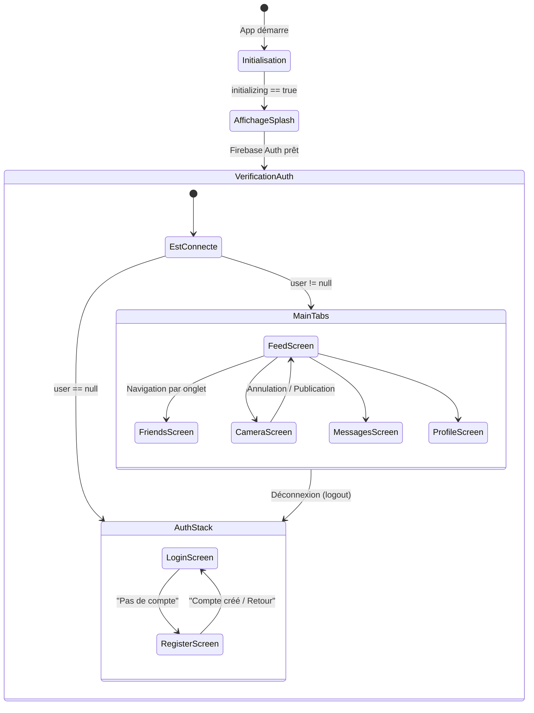

# 🏛️ Architecture Globale & Choix Technologiques

Ce document présente l'architecture de référence de **TikTokClone**, une application mobile développée en **React Native (TypeScript)** s'appuyant sur l'infrastructure de services **Firebase**.

---

## 1. Vue d'ensemble Technologique

L'application repose sur un découpage en trois couches distinctes :
1. **L'Interface Utilisateur (UI) & Navigation** : Écrite en TSX, utilisant les styles natifs `StyleSheet` et pilotée par `React Navigation` (v7).
2. **La Couche Services & Logique Métier** : Fonctions asynchrones encapsulant les appels aux modules Firebase (Auth, Firestore, Storage) avec gestion d'erreurs et logging.
3. **Le Backend Cloud (Firebase)** : Base de données NoSQL (Cloud Firestore), stockage binaire (Cloud Storage) et serveur d'authentification, protégés par des règles d'accès strictes.

```mermaid
graph TD
    subgraph Client Mobile [Client React Native & TypeScript]
        UI[Couche UI: Écrans / Composants TSX] -->|Hooks / Contextes| Hooks[useAuth / AuthProvider]
        UI -->|Appels Directs| Services[Services: postService, authService, storageService]
        Services -->|Contrats Communs| Contracts[contracts.ts: User, Post, Comment]
    end

    subgraph Firebase Cloud [Backend Firebase]
        Services -->|SDK Firebase Auth| FAuth[(Firebase Authentication)]
        Services -->|SDK Firestore| FStore[(Cloud Firestore DB)]
        Services -->|SDK Storage| FStorage[(Cloud Storage Files)]
    end

    subgraph CI/CD Pipeline
        GitHub[Workflows GitHub Actions] -->|Compilation Native| APK[Artefact APK / AAB]
    end
    
    Client Mobile -.->|Code poussé vers Git| GitHub
```

---

## 2. Structure du Dépôt

Le code source de l'application est centralisé dans le dossier `src/` et est structuré de la manière suivante :

| Dossier | Rôle Académique | Fichiers Clés |
| :--- | :--- | :--- |
| **`src/shared/`** | Définition des structures de données partagées (contrats). | `contracts.ts` |
| **`src/contexts/`** | Fournisseurs d'état globaux (ex: Session d'authentification). | `AuthProvider.tsx` |
| **`src/hooks/`** | Hooks personnalisés facilitant la consommation des états. | `useAuth.ts` |
| **`src/navigation/`** | Configuration des piles d'écrans et onglets. | `RootNavigator.tsx`, `MainTabs.tsx`, `AuthStack.tsx` |
| **`src/screens/`** | Vues principales associées à chaque onglet ou flux. | `FeedScreen.tsx`, `CameraScreen.tsx`, `ProfileScreen.tsx` |
| **`src/components/`** | Éléments d'interface réutilisables ou modales complexes. | `VideoPlayer.tsx`, `OverlayActions.tsx`, `CommentSectionModal.tsx` |
| **`src/services/`** | Couche d'accès aux données (Data Access Object / Services). | `authService.ts`, `postService.ts`, `storageService.ts` |
| **`src/utils/`** | Utilitaires transversaux (logger, formatage). | `logger.ts` |

---

## 3. Contrat de Données Centralisé (`contracts.ts`)

Pour éviter la duplication des types et assurer une cohérence stricte entre les services et l'interface utilisateur, toutes les interfaces de données Firestore sont centralisées dans [contracts.ts](file:///run/media/Aristide/Windows/Users/pacco/TikTokClone/src/shared/contracts.ts).

### Profil Utilisateur (`User`)
Représente le document stocké dans la collection Firestore `/users/{uid}`.
```typescript
export interface User {
  uid: string;          // UID Firebase Auth unique de l'utilisateur
  email: string;        // Adresse email
  username: string;     // Pseudonyme unique en minuscules
  avatarUrl: string;    // Lien HTTPS de la photo de profil (Storage ou défaut)
  followersCount: number; // Nombre d'abonnés
  followingCount: number; // Nombre d'abonnements
  createdAt: number;    // Timestamp Epoch (ms) de création du compte
}
```

### Publication Vidéo (`Post`)
Représente le document stocké dans la collection Firestore `/posts/{postId}`.
```typescript
export interface Post {
  id: string;           // ID unique du document Firestore
  userId: string;       // UID de l'auteur du post
  videoUrl: string;     // Lien HTTPS public de la vidéo (Cloud Storage)
  title?: string;       // Titre facultatif du post (max 80 chars)
  description: string;  // Description textuelle (max 2200 chars)
  likesCount: number;   // Nombre cumulé de J'aime
  commentsCount: number; // Nombre cumulé de commentaires
  createdAt: number;    // Timestamp Epoch de publication
}
```

### Commentaire (`Comment`)
Représente le document stocké dans la sous-collection `/posts/{postId}/comments/{commentId}`.
```typescript
export interface Comment {
  id: string;           // ID unique du commentaire
  userId: string;       // UID du contributeur
  username: string;     // Pseudonyme du contributeur au moment de l'écriture
  text: string;         // Contenu textuel (max 500 chars)
  createdAt: number;    // Timestamp Epoch d'écriture
}
```

---

## 4. Flux de Navigation et Cycle de Vie de l'Authentification

L'accès aux différents écrans est entièrement contrôlé par le hook [useAuth](file:///run/media/Aristide/Windows/Users/pacco/TikTokClone/src/hooks/useAuth.ts), qui observe l'état d'authentification en direct de Firebase.



1. **`RootNavigator`** écoute l'état renvoyé par `AuthProvider`. Tant que `initializing` est vrai, l'application reste bloquée sur un indicateur de chargement noir (splashscreen).
2. Si aucun utilisateur n'est connecté (`user == null`), l'application charge le [AuthStack](file:///run/media/Aristide/Windows/Users/pacco/TikTokClone/src/navigation/AuthStack.tsx) (écrans `Login` et `Register`). L'accès aux onglets principaux est rendu techniquement impossible au niveau natif.
3. Dès que l'utilisateur est authentifié (`user != null`), le navigateur bascule dynamiquement sur [MainTabs](file:///run/media/Aristide/Windows/Users/pacco/TikTokClone/src/navigation/MainTabs.tsx), exposant les 5 onglets du clone TikTok.
