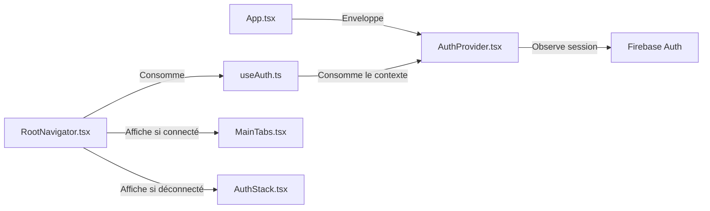
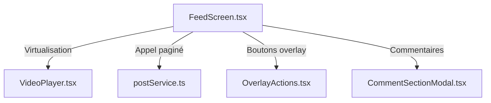

# 🧩 Documentation Détaillée des Modules & Liens Internes

Ce document détaille chaque module fonctionnel de l'application, en explicitant le rôle de chaque fichier, ses fonctions phares, et ses dépendances avec d'autres parties du projet.

---

## 1. Module d'Authentification & Navigation Racine

Ce module gère le cycle de vie de la session utilisateur et le routage initial de l'application.

### 📁 Fichiers clés et Rôles :
* **`App.tsx` (Racine)** : Enveloppe toute l'application dans les providers système indispensables (`GestureHandlerRootView`, `SafeAreaProvider`, `StatusBar`, `ErrorBoundary`, et `AuthProvider`).
* **`src/contexts/AuthProvider.tsx`** :
  * *Rôle* : Initialise l'état Firebase Auth. Déclare un écouteur `onAuthStateChanged` pour surveiller les connexions/déconnexions.
  * *Fonctions* : Récupère en parallèle le document utilisateur depuis Firestore via `authService.getUserProfile(uid)`.
* **`src/hooks/useAuth.ts`** :
  * *Rôle* : Fournit un hook personnalisé `useAuth()` permettant à n'importe quel composant de consommer l'utilisateur actuel (`user`), son profil Firestore (`profile`), l'état de chargement (`loading`/`initializing`), et la fonction de déconnexion (`logout`).
* **`src/navigation/RootNavigator.tsx`** :
  * *Rôle* : Fait office de barrière de sécurité (Guard). Redirige dynamiquement vers `MainTabs` ou `AuthStack`.
* **`src/navigation/AuthStack.tsx`** & **`src/navigation/MainTabs.tsx`** :
  * *Rôle* : Configuration typée des routes. `MainTabs` configure la barre d'onglets inférieure noire typique de TikTok avec 5 écrans.
* **`src/screens/auth/LoginScreen.tsx`** & **`RegisterScreen.tsx`** :
  * *Rôle* : Formulaires d'authentification appelant `authService.login()` et `authService.register()`.

---

## 2. Module Vidéo (Le Moteur du Flux)

Ce module est responsable du chargement asynchrone des publications vidéo, du défilement fluide vertical, et de la mise en pause/lecture automatique.

### 📁 Fichiers clés et Rôles :
* **`src/screens/FeedScreen.tsx`** :
  * *Rôle* : Affiche la liste infinie verticale de vidéos.
  * *Variables clés* : 
    * `videos` : État contenant la liste des objets `Post`.
    * `activeIndex` & `activePostId` : Indiquent quel est l'élément actuellement centré à l'écran.
  * *Propriétés FlatList critiques pour la performance* :
    * `pagingEnabled={true}` : Force l'effet d'aimantation écran par écran (view paging).
    * `windowSize={3}`, `initialNumToRender={2}`, `maxToRenderPerBatch={2}` : Restreint le nombre d'éléments conservés en mémoire.
    * `getItemLayout` : Calcule à l'avance la hauteur exacte des cartes de flux pour éviter le re-calcul dynamique de layout.
    * `removeClippedSubviews={true}` : Libère les ressources système pour les composants hors écran.
* **`src/components/VideoPlayer.tsx`** :
  * *Rôle* : Contient le lecteur vidéo natif `Video` issu de `react-native-video`.
  * *Fonction de lecture* : Utilise la prop `isActive` (calculée par le parent `FeedScreen` selon l'index actif et le focus d'onglet `useIsFocused`) pour basculer la prop native `paused={!isActive}`.
* **`src/components/OverlayActions.tsx`** :
  * *Rôle* : Affiche les actions flottantes superposées à droite de la vidéo (Likes, Commentaires, Partage, Profil Créateur, Disque de musique rotatif).

---

## 3. Module d'Engagement Social

Gère le profil utilisateur, l'ajout et l'affichage des commentaires, et l'interaction des likes.

### 📁 Fichiers clés et Rôles :
* **`src/components/CommentSectionModal.tsx`** :
  * *Rôle* : Modale de type "Bottom Sheet" qui glisse vers le haut pour afficher les commentaires d'une vidéo.
  * *Logique* : Utilise `postService.getComments(postId)` à l'ouverture, et met à jour la liste après l'ajout réussi via `postService.addComment()`.
* **`src/screens/ProfileScreen.tsx`** :
  * *Rôle* : Affiche le profil de l'utilisateur connecté, ses statistiques (Abonnements, Abonnés, J'aime cumulés), un bouton de déconnexion et une grille à 3 colonnes de ses vidéos.
  * *Fonctions* :
    * `fetchUserContent()` : Récupère les vidéos de l'utilisateur via `postService.getUserPosts(uid)`.
    * `posts.reduce(...)` : Calcule dynamiquement le nombre total de mentions J'aime cumulées sur l'ensemble de ses vidéos locales.

---

## 4. Module Caméra & Création de Contenu

Gère la capture vidéo via la caméra et le microphone physiques de l'appareil et le processus de publication.

### 📁 Fichiers clés et Rôles :
* **`src/screens/CameraScreen.tsx`** :
  * *Rôle* : Écran à double état (1. Caméra active pour filmer, 2. Formulaire de publication blanc).
  * *Intégration native* : Utilise `react-native-vision-camera`.
  * *Fonctions* :
    * `Camera.requestCameraPermission()` & `requestMicrophonePermission()` : Appels asynchrones au démarrage pour obtenir l'accord du système d'exploitation.
    * `handleRecordVideo()` : Lance `cameraRef.current.startRecording()` et stoppe sur une deuxième pression. Enregistre le fichier temporaire MP4 local dans le stockage de l'application (`video.path`).
    * `handlePublish()` : Collecte le titre, la description et appelle le service d'envoi.

---

## 5. Module Services & Utilitaires (Accès Cloud)

C'est la couche d'abstraction de données (DAO) qui communique directement avec les SDK Firebase natifs.

### 📁 Fichiers clés et Rôles :
* **`src/services/authService.ts`** :
  * *`register(email, password, username)`* : Inscription Firebase Auth. Crée immédiatement après un document dans Firestore `/users/{uid}` avec les statistiques par défaut à 0.
  * *`login(email, password)`* : Connexion classique.
  * *`getUserProfile(uid)`* : Télécharge les détails du document Firestore de l'utilisateur.
* **`src/services/postService.ts`** :
  * *`getFeedPage(pageSize, cursor)`* : Récupère les posts ordonnés par date décroissante pour le fil d'actualité. Gère la pagination de type curseur Firestore (`startAfter`).
  * *`createPost(CreatePostInput)`* : Orchestre l'upload de la vidéo locale en appelant `storageService.uploadVideo` puis, en cas de succès, crée la fiche post sur Firestore.
  * *`toggleLike(postId, userId)`* : Utilise `firestore().runTransaction` pour vérifier si le like existe dans la sous-collection `posts/{postId}/likes/{userId}`. Si oui, le supprime et décrémente le compteur du post. Si non, l'ajoute et incrémente le compteur.
  * *`addComment(postId, userId, username, text)`* : Ajoute un commentaire dans la sous-collection Firestore `comments` sous forme de transaction et incrémente `commentsCount` sur le post parent.
* **`src/services/storageService.ts`** :
  * *`uploadVideo(postId, filePath)`* : Téléverse le fichier vidéo local du téléphone vers `/posts/{postId}/video.mp4` dans Firebase Storage. Retourne l'URL de téléchargement publique.
* **`src/utils/logger.ts`** :
  * *Rôle* : Fournit une interface de journalisation (`debug`, `info`, `warn`, `error`) configurable pour éviter de polluer la console en production.
