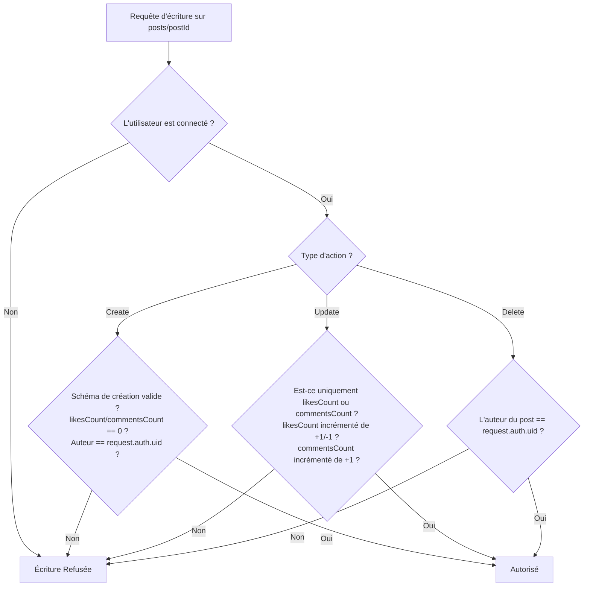

# 🔒 Sécurité du Cloud & Règles d'Accès Firebase

Ce document détaille les règles de sécurité appliquées aux bases de données **Cloud Firestore** et au stockage **Cloud Storage** pour le projet **TikTokClone**. Ces règles sont le seul rempart contre les modifications illicites de la part d'utilisateurs malveillants contournant l'application mobile.

---

## 1. Principes Communs de Sécurité

Les deux services partagent des fonctions de base pour valider l'identité de l'appelant :
* **`isSignedIn()`** : Vérifie que la requête contient un jeton d'authentification Firebase valide (`request.auth != null`).
* **`isOwner(userId)`** : Vérifie que l'UID de l'utilisateur authentifié correspond à l'ID de la ressource ciblée.

---

## 2. Guide des Règles Firestore (`firestore.rules`)

Le fichier [firestore.rules](file:///run/media/Aristide/Windows/Users/pacco/TikTokClone/firestore.rules) implémente des validations de schéma très poussées.

### A. Collection `/users/{userId}`
* **Lecture** : Autorisée pour tout utilisateur connecté (`isSignedIn()`), pour permettre l'affichage des profils des créateurs dans le Feed.
* **Écriture (Création, Modification, Suppression)** : Autorisée uniquement si l'utilisateur est propriétaire du profil (`isOwner(userId)`). Un utilisateur ne peut pas modifier le nom d'un autre utilisateur.

### B. Collection `/posts/{postId}`
C'est la collection la plus exposée. Ses règles préviennent plusieurs failles critiques :

1. **Validation stricte à la création (`allow create`)** :
   * L'utilisateur doit être connecté.
   * L'UID déclaré dans le post doit correspondre à son UID d'authentification (`request.resource.data.userId == request.auth.uid`). Cela empêche l'usurpation d'identité.
   * Le document doit contenir tous les champs requis et **uniquement** ceux autorisés (`hasOnly` / `hasAll`).
   * Les compteurs `likesCount` et `commentsCount` doivent impérativement démarrer à `0`. (Empêche un utilisateur de tricher en publiant une vidéo ayant déjà 1 million de likes fictifs).
   * Vérification des types et limites de taille : la description doit faire moins de 2200 caractères et le titre moins de 80 caractères.

2. **Validation stricte de modification (`allow update`)** :
   * Un utilisateur ne doit jamais pouvoir modifier la vidéo, la description ou l'auteur d'un post déjà publié.
   * La mise à jour est restreinte **exclusivement** aux modifications induites par les likes et commentaires :
     * **Toggle Like (Transaction)** : Seul le champ `likesCount` peut être modifié. L'écart (diff) avec l'ancienne valeur doit être de `+1` (nouveau like) ou `-1` (retrait du like), ou `0` si on tente de descendre en dessous de 0 (géré par le `Math.max(0, n-1)`).
     * **Add Comment (Transaction)** : Seul le champ `commentsCount` peut être modifié et sa valeur finale doit être égale à la valeur précédente `+1`.

3. **Validation de suppression (`allow delete`)** :
   * Seul l'auteur d'origine du post (`resource.data.userId == request.auth.uid`) peut supprimer son document.

### C. Sous-collection `/posts/{postId}/likes/{userId}`
* L'identifiant du document dans cette sous-collection est l'UID du liker.
* **Création** : Autorisée si le `likeUserId` et le champ `userId` correspondent à l'utilisateur connecté (`likeUserId == request.auth.uid`). Empêche de liker au nom d'un autre utilisateur.
* **Suppression** : Autorisée uniquement si le document appartient à l'utilisateur connecté (`likeUserId == request.auth.uid`). Empêche de retirer le like d'un autre utilisateur.

### D. Sous-collection `/posts/{postId}/comments/{commentId}`
* **Création** : Un utilisateur connecté peut commenter.
  * Validation du schéma : Le document doit contenir `userId`, `username`, `text`, `createdAt` et aucun autre champ.
  * Le `userId` doit être égal à son UID d'auth.
  * Le texte du commentaire doit faire moins de 500 caractères.
* **Modification** : Strictement interdite (`allow update: if false`). On ne peut pas modifier un commentaire déjà écrit (standard sur TikTok).
* **Suppression** : Autorisée uniquement si l'UID de l'auteur du commentaire correspond à l'utilisateur connecté.

---

## 3. Guide des Règles de Stockage (`storage.rules`)

Le fichier [storage.rules](file:///run/media/Aristide/Windows/Users/pacco/TikTokClone/storage.rules) protège l'espace de stockage binaire.

### A. Dossier des Avatars : `/users/{uid}/avatar.jpg`
* **Lecture** : Autorisée à tout utilisateur authentifié.
* **Écriture** : Réservée au propriétaire du compte (`request.auth.uid == uid`).
* **Sécurité des données** : Le fichier doit faire moins de 5 Mo et son format MIME doit correspondre à une image (`request.resource.contentType.matches('image/.*')`). Empêche l'envoi de fichiers malveillants (scripts shell, exe) se faisant passer pour un avatar.

### B. Dossier des Vidéos : `/posts/{postId}/video.mp4`
* **Lecture** : Autorisée à tout utilisateur authentifié.
* **Écriture** : Autorisée à tout utilisateur authentifié (puisque l'ID de post est généré aléatoirement côté client avant le dépôt).
* **Sécurité des données** : La vidéo doit faire moins de 100 Mo et son format MIME doit être une vidéo (`request.resource.contentType.matches('video/.*')`). Empêche de surcharger l'espace disque de stockage Firebase ou d'envoyer des fichiers non vidéo.
